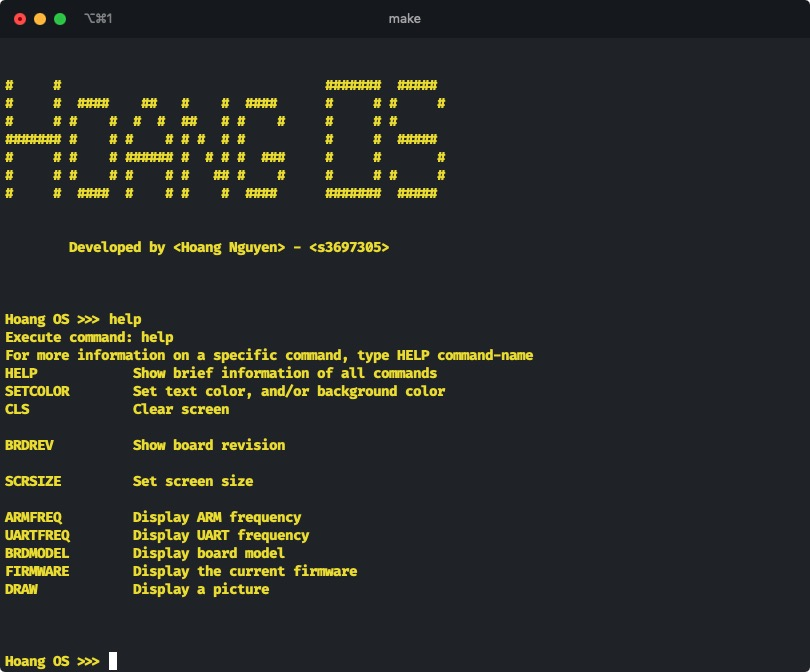
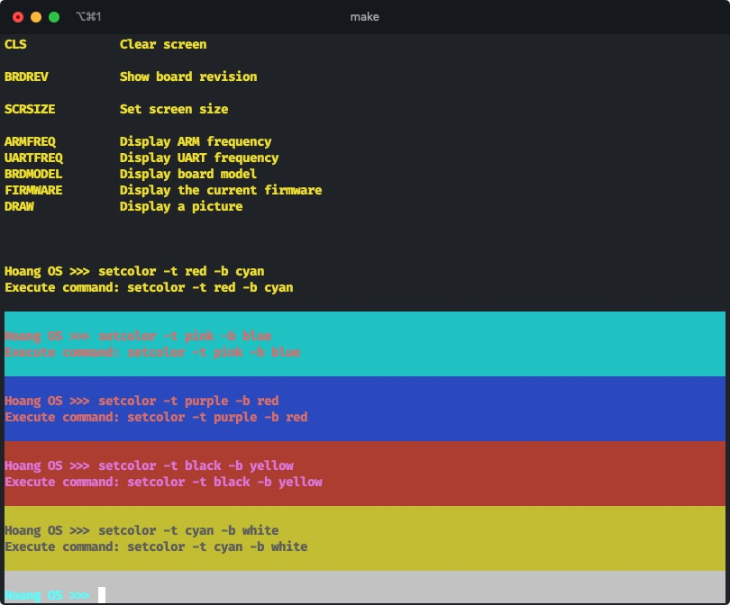
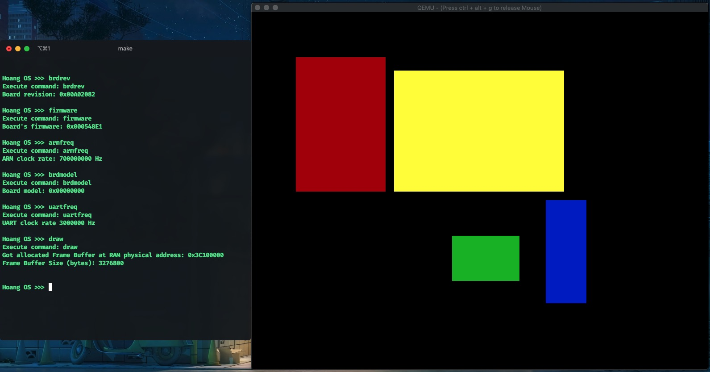
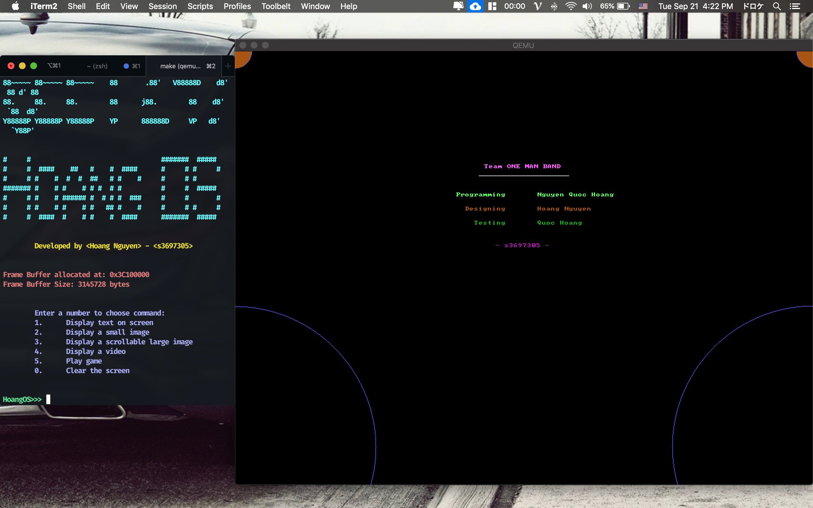
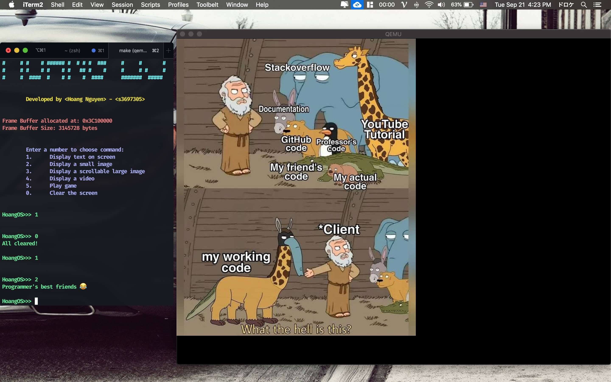
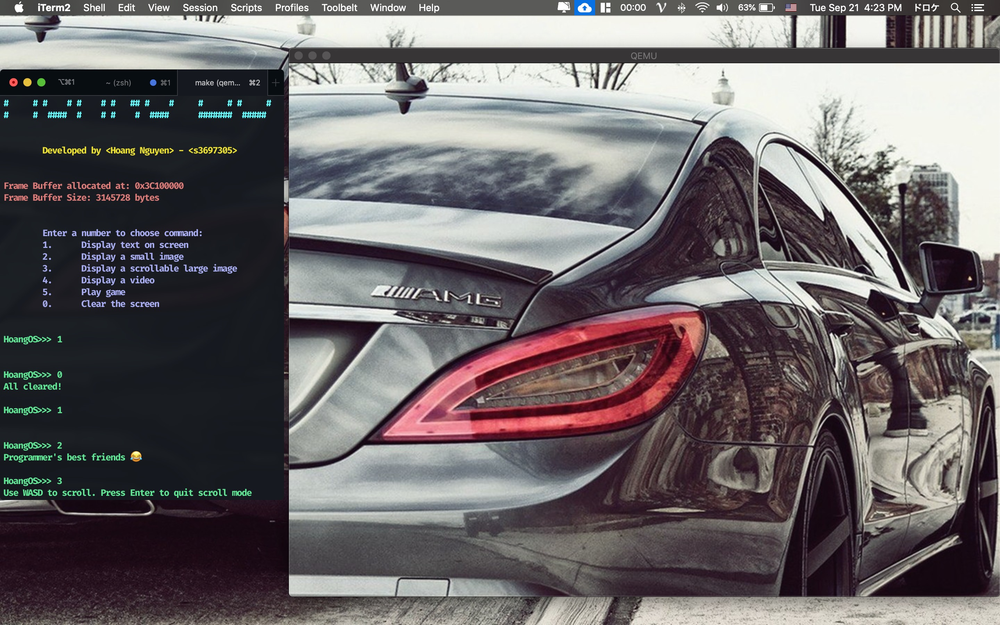
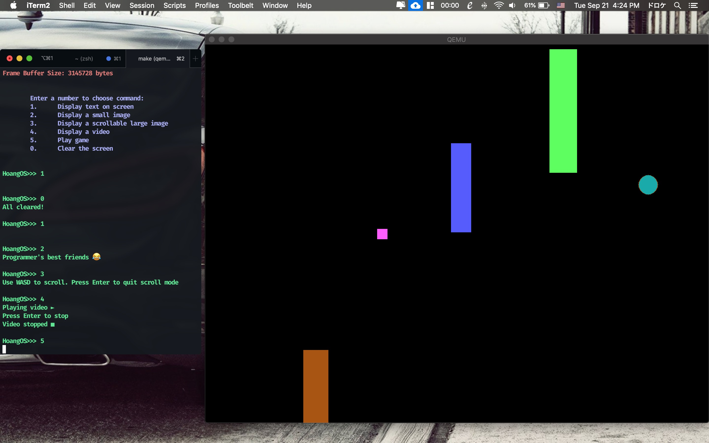

# Bare metal OS on Raspberry Pi 3 Model B+

### Table of Contents
* [Project Description](#description)
    * [Version 1](#version1)
    * [Version 2](#version2) 
* [Setting up development environment for MacOS](#macOS)
* [How to run project?](#run)
* [Acknowledgement](#acknowledgement)
* [Connect](#connect)

# Project Description
<!-- * My final project for EEET2481 - Embedded System Design and Implementation
* Whac-A-Mole style game with a mix of my favorite meme - BONK!
* Implemented for Nuvoton Nu-LB-NUC140 development board -->
This project includes 2 versions of bare metal operating systems for the Raspberry Pi 3 Model B+. Version 1 is more about interracting with the Rasp using UART and Mailbox, while Version deals more with the graphical interface.

# Version 1
This version mainly uses the CLI to interract with the OS using the provided commands. Compile and run the image, type `help` to see all the available commands

Welcome screen with help command

Set terminal text and background colors

Draw graphic on screen

# Version 2
This version concerns more about the Graphical User Interface, allowing the user to control what being displayed on screen, and even play a mini game called "Rescue the Pink-cess". Use the CLI to control the screen

Welcome screen with text display

Display small image

User can use WASD to scroll with large image

Pressing 4 will play this gif on QEMU screen

"Rescue the Pink-cess" game

# Setting up Development environment for MacOS
Since I am using a Mac computer, my development environment is different from a Windows machine and requires different configurations. I prefer using VSCode as my code editor over other IDEs for its elegance and functionalities. Install the following toolchain for developing ARM on a Mac using Brew (package manager):
-	GNU Embedded Toolchain for ARM (Mac 64-bit): `brew tap SergioBenitez/osxct` and `brew install aarch64-none-elf`
-	Make tool: `brew install make`
-	QEMU: `brew install qemu`
-	LLVM/Clang: `brew install --with-toolchain llvm`
-   To run Raspberry Pi OS, install Raspberry Pi Desktop and run image using Parallels Desktop (or other VMs)

# How to run project?
You would need a Raspberry Pi 3B+ board to run the OS. However, you can also use <a href="https://www.qemu.org/download/" target="_blank">QEMU</a> to emulate the Rasp on your PC. You will also need make build tool to compile or run QEMU commands automatically.
In every folder, you will find an already built image `kernel8.img` that you can use `make` command to run it directly.

# Demo video
Version 2:

# Acknowledgement
- Tool for converting between images and byte arrays: https://javl.github.io/image2cpp/
- Font glyphs are from: https://www.rpi4os.com/part5-framebuffer/

# Connect with me
* My [Website](https://hoangdesu.com/)
* My [LinkedIn](https://www.linkedin.com/in/hoangdesu/)
* My [Facebook](https://www.facebook.com/Hoangdayo/)
* My [Instagram](https://www.instagram.com/hoang.desu/)
* You can shoot me an [email](mailto:hoangdesu@gmail.com) too!

If you find this project useful, you can let me know. I would love to hear about it! ✌️

